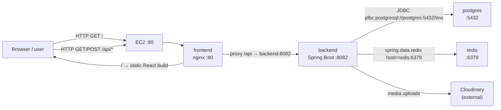

# AWS Deployment Guide — Xebia LMS (SSH + Docker Compose)

The CI/CD pipeline builds images, pushes them to Docker Hub, then SSHs into an AWS EC2 instance to pull and run the **new image tag** on every deploy.

---

## Complete deployment overview

### What runs where

Production runs **four Docker containers** on a single EC2 instance, orchestrated by `docker-compose.yml` in the deploy directory (`/home/ubuntu/xebia-lms` by default). All containers share a **private Docker network** created by Compose. Service names (`postgres`, `redis`, `backend`, `frontend`) are DNS hostnames on that network.

| Container | Image | Internal port | Published to host (production) | Role |
|-----------|-------|---------------|--------------------------------|------|
| `xebia-lms-frontend` | `username/xebia-lms-frontend:<tag>` | **80** (nginx) | **80** → EC2 public HTTP | Serves React static files; proxies `/api` to backend |
| `xebia-lms-backend` | `username/xebia-lms-backend:<tag>` | **8082** (Spring Boot) | *none* | REST API, JPA, Redis cache, Cloudinary uploads |
| `xebia-lms-postgres` | `postgres:16-alpine` | **5432** | *none* | Primary database (`lms` DB) |
| `xebia-lms-redis` | `redis:7-alpine` | **6379** | *none* | Cache layer (AOF persistence) |

**Only port 80 is exposed to the internet.** Postgres, Redis, and the backend are reachable only inside the Docker network. The EC2 security group should allow inbound **22** (SSH) and **80** (HTTP).

For **local development**, copy `docker-compose.override.yml.example` to `docker-compose.override.yml` to also publish `5432`, `6379`, and `8082` on localhost.

### How traffic flows (browser → app → data)



1. **User → frontend:** Browser hits `http://<ec2-ip>/`. Nginx serves the built React app from `/usr/share/nginx/html`.
2. **User → backend (via frontend):** API calls go to `/api/...` on the same host. Nginx proxies them to `http://backend:8082/api/...` (see `frontend/nginx.conf.template`).
3. **Backend → PostgreSQL:** Spring connects with `SPRING_DATASOURCE_URL=jdbc:postgresql://postgres:5432/lms` (hostname `postgres` = Compose service name).
4. **Backend → Redis:** Spring Data Redis uses `REDIS_HOST=redis` and `REDIS_PORT=6379`. Cache misses or Redis errors fall back to reading/writing PostgreSQL directly.
5. **Backend → Cloudinary:** File uploads use credentials from `.env` (`CLOUDINARY_*`); this is outbound HTTPS to Cloudinary, not another container.

### Container startup order

Compose uses `depends_on` with **health checks** so services start in the right order:

```
postgres ──┐
           ├──► backend ──► frontend
redis ─────┘
```

| Step | What happens |
|------|----------------|
| 1 | `postgres` and `redis` start (or stay running if already up) |
| 2 | Health checks: `pg_isready` (postgres), `redis-cli ping` (redis) |
| 3 | `backend` starts only after both are **healthy** |
| 4 | Backend health check: `curl http://localhost:8082/api/categories` |
| 5 | `frontend` starts only after backend is **healthy** |
| 6 | Frontend listens on port 80 and begins proxying `/api` |

`deploy.sh` explicitly starts postgres + redis first, waits for health, then pulls and recreates backend + frontend.

### What gets built vs pulled

| Artifact | Built by | Stored in | Updated on each deploy? |
|----------|----------|-----------|-------------------------|
| Backend JAR → Docker image | GitHub Actions (`backend/Dockerfile`) | Docker Hub | **Yes** (new `<git-sha>` tag) |
| Frontend build → nginx image | GitHub Actions (`frontend/Dockerfile`) | Docker Hub | **Yes** (new `<git-sha>` tag) |
| PostgreSQL data | — | Docker volume `postgres_data` | **No** (persists across deploys) |
| Redis cache data | — | Docker volume `redis_data` | **No** (persists; AOF enabled) |

Postgres and Redis use **official upstream images** (`postgres:16-alpine`, `redis:7-alpine`). They are not custom-built. Only backend and frontend are application images from your Docker Hub repos.

### PostgreSQL handling

- **Container:** `xebia-lms-postgres`
- **Credentials:** from server `.env` — `POSTGRES_DB`, `POSTGRES_USER`, `POSTGRES_PASSWORD`
- **Data directory:** mounted at `postgres_data:/var/lib/postgresql/data` (survives container restarts and image updates)
- **Backend connection string (default):** `jdbc:postgresql://postgres:5432/lms`
- **Schema:** Hibernate `ddl-auto=update` applies schema changes on startup
- **Not exposed publicly** in production; backend reaches it by service name on the internal network

**Optional RDS:** Set `SPRING_DATASOURCE_URL` (and username/password) in `.env` to an Amazon RDS endpoint, then `docker compose stop postgres`. RDS must allow inbound **5432** from the EC2 security group.

### Redis handling

- **Container:** `xebia-lms-redis`
- **Command:** `redis-server --appendonly yes` (AOF persistence to `redis_data` volume)
- **Backend config:** `REDIS_HOST=redis`, `REDIS_PORT=6379` (must be the Compose service name, **not** `localhost`)
- **Usage:** Caches category/course lists and individual entities (30-minute TTL). On Redis failure, `RedisService` returns `null` and services read from PostgreSQL.
- **Not exposed publicly** in production

### Environment and secrets

| Location | Contains |
|----------|----------|
| **GitHub Secrets** | `DOCKERHUB_*`, `SSH_*`, optional `DEPLOY_PATH` — used only by CI to build, push, and SSH |
| **Server `/home/ubuntu/xebia-lms/.env`** | `POSTGRES_PASSWORD`, Cloudinary keys, `FRONTEND_PORT`, optional RDS URL — never committed to git |
| **Injected at deploy time by CI** | `IMAGE_TAG` (git SHA), `DOCKERHUB_TOKEN` (for `docker login` on the server) |

---

## CI/CD pipeline architecture

```
GitHub Actions
    │
    ├─ Build & Test (Maven + npm, ephemeral postgres + redis on localhost)
    ├─ Docker Build & Push → Docker Hub (tag: <git-sha> + latest)
    └─ SSH Deploy → EC2 instance
                        │
                        1. SCP docker-compose.yml + deploy.sh
                        2. deploy.sh: docker login
                        3. start postgres + redis (wait until healthy)
                        4. pull backend + frontend (IMAGE_TAG=<sha>)
                        5. docker compose up -d --remove-orphans
                        │
                        ├─ frontend  (Docker Hub image)  :80 public
                        ├─ backend   (Docker Hub image)  :8082 internal
                        ├─ postgres  (official image)    :5432 internal
                        └─ redis     (official image)    :6379 internal
```

Each push to `main` builds a new image tagged with the commit SHA (e.g. `a1b2c3d`). The deploy step passes that tag to the server so containers always run the freshly built image.

## 1. EC2 Instance Setup

Launch an EC2 instance (Ubuntu 22.04 or Amazon Linux 2023):

- **Instance type:** `t3.small` or larger
- **Security group:** allow inbound `22` (SSH) and `80` (HTTP) from your IP / `0.0.0.0/0`
- **Storage:** 20 GB+ recommended

SSH in and run the one-time setup script:

```bash
curl -fsSL https://raw.githubusercontent.com/<your-org>/<your-repo>/main/deploy/scripts/server-setup.sh | bash
```

Or copy `deploy/scripts/server-setup.sh` manually and run it.

Edit `/home/ubuntu/xebia-lms/.env` with your database and Cloudinary credentials.

Copy `docker-compose.yml` and `deploy/scripts/deploy.sh` into `/home/ubuntu/xebia-lms` (the CI pipeline uploads these on every deploy).

## 2. Docker Hub

Create two repositories:

- `xebia-lms-backend`
- `xebia-lms-frontend`

Generate an access token at [Docker Hub → Security](https://hub.docker.com/settings/security).

## 3. GitHub Secrets

Add these in **Settings → Secrets and variables → Actions**:

| Secret | Description |
|--------|-------------|
| `DOCKERHUB_USERNAME` | Docker Hub username |
| `DOCKERHUB_TOKEN` | Docker Hub access token |
| `SSH_HOST` | EC2 public IP or DNS (e.g. `3.110.x.x`) |
| `SSH_USER` | `ubuntu` (Ubuntu) or `ec2-user` (Amazon Linux) |
| `SSH_PRIVATE_KEY` | Full contents of your `.pem` key file |
| `SSH_PORT` | Optional, default `22` |
| `DEPLOY_PATH` | Optional, default `/home/ubuntu/xebia-lms` |

App secrets (`POSTGRES_PASSWORD`, Cloudinary keys, etc.) live in the **server** `.env` file at `${DEPLOY_PATH}/.env`, not in GitHub.

## 4. Pipeline Behavior

| Trigger | Build & Test | Docker Push | SSH Deploy |
|---------|-------------|-------------|------------|
| Pull request to `main` | Yes | No | No |
| Push to `main` | Yes | Yes | Yes |

## 5. What Happens on Deploy (step by step)

1. **Build & test (CI):** Maven tests against ephemeral Postgres/Redis on `localhost:5432` / `6379`; frontend builds with `VITE_API_URL=/api`.
2. **Docker build & push:** Images pushed as `username/xebia-lms-backend:<sha>` and `username/xebia-lms-frontend:<sha>` (plus `latest`).
3. **Copy files:** `docker-compose.yml` and `deploy/scripts/deploy.sh` are SCP'd to `${DEPLOY_PATH}` on EC2.
4. **SSH runs `deploy.sh`:**
   - Loads server `.env` (secrets); `IMAGE_TAG` from CI overrides any value in `.env`
   - `docker login` to Docker Hub
   - `docker compose pull postgres redis` → `up -d postgres redis` → wait for healthy
   - `docker compose pull backend frontend` → `up -d --remove-orphans` → wait for backend healthy
   - `docker image prune -f` to remove dangling layers
5. **Runtime:** Backend connects to `postgres:5432` and `redis:6379`; frontend proxies `/api` to `backend:8082`.

### Port reference (production vs local)

| Service | Inside container | Production (host) | Local with `docker-compose.override.yml` |
|---------|------------------|-------------------|------------------------------------------|
| Frontend (nginx) | 80 | **80** (configurable via `FRONTEND_PORT`) | 80 |
| Backend (Spring) | 8082 | not published | **8082** (`BACKEND_PORT`) |
| PostgreSQL | 5432 | not published | **5432** (`POSTGRES_PORT`) |
| Redis | 6379 | not published | **6379** (`REDIS_PORT`) |
| EC2 SSH | — | **22** | — |

### PostgreSQL & Redis in production

| Service | Container | Persistence | Backend connection |
|---------|-----------|-------------|-------------------|
| PostgreSQL | `xebia-lms-postgres` | `postgres_data` volume | `jdbc:postgresql://postgres:5432/lms` |
| Redis | `xebia-lms-redis` | `redis_data` volume (AOF) | `REDIS_HOST=redis`, `REDIS_PORT=6379` |

- Postgres and Redis are **not** redeployed on each CI run — only `backend` and `frontend` images are updated.
- Backend waits for both Postgres and Redis to be healthy before starting.
- If Redis is temporarily unavailable at runtime, the app falls back to PostgreSQL (cache miss).

## 6. Manual Deploy (on server)

```bash
cd /home/ubuntu/xebia-lms
export IMAGE_TAG=a1b2c3d        # specific build tag
export DOCKERHUB_USERNAME=your-user
export DOCKERHUB_TOKEN=your-token
./deploy/scripts/deploy.sh
```

## 7. Using Amazon RDS (optional)

To use RDS instead of the bundled Postgres container, set in `/home/ubuntu/xebia-lms/.env`:

```env
SPRING_DATASOURCE_URL=jdbc:postgresql://your-rds-endpoint:5432/lms
SPRING_DATASOURCE_USERNAME=postgres
SPRING_DATASOURCE_PASSWORD=your-password
```

Then stop the local postgres container:

```bash
docker compose stop postgres
```

Ensure the RDS security group allows inbound `5432` from the EC2 instance.

## 8. Troubleshooting

- **Permission denied (docker):** log out and back in after `server-setup.sh`, or run `newgrp docker`
- **502 from frontend:** backend may still be starting — check `docker compose logs backend`
- **Old image still running:** verify `IMAGE_TAG` in deploy logs matches the latest push tag on Docker Hub
- **SSH fails in CI:** confirm `SSH_PRIVATE_KEY` includes the full PEM block with newlines
- **Backend can't connect to Postgres:** ensure `POSTGRES_PASSWORD` in `.env` matches the value used when the volume was first created; if you changed it, reset with `docker compose down -v` (destroys data) or update the password inside the container
- **Redis cache not working:** check `docker compose logs redis` and confirm `REDIS_HOST=redis` in `.env` (not `localhost`)
