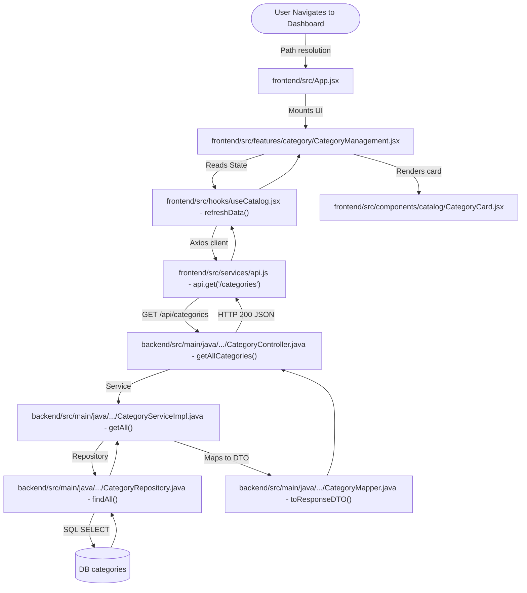
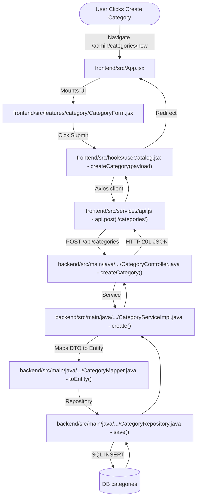

# Category Module Flow & Reference Documentation

This document outlines the Category module's data fields and the end-to-end frontend-to-backend request flows.

---

## 1. Category Entity Fields

*   **Database Table:** `categories`
*   **Entity File:** backend/src/main/java/com/geeknito/LMS_backend/entity/learning/CategoryEntity.java
*   **Request DTO:** backend/src/main/java/com/geeknito/LMS_backend/dto/CategoryRequestDTO.java
*   **Response DTO:** backend/src/main/java/com/geeknito/LMS_backend/dto/CategoryResponseDTO.java

### Field List
1.  `id` (`Long`, Primary Key, Generated Identity)
2.  `name` (`String`, `NOT NULL`, `UNIQUE`, max 100 chars)
3.  `icon` (`String`, Emoji or image URL)
4.  `description` (`String`, TEXT)
5.  `color` (`String`, Hex code, max 20 chars)
6.  `isActive` (`Boolean`, default `true`)
7.  `logo` (`String`, image URL)
8.  `bannerImage` (`String`, image URL)
9.  `backgroundImage` (`String`, image URL)
10. `thumbnail` (`String`, image URL)
11. `createdAt` / `updatedAt` (`LocalDateTime` timestamps)

---

## 2. End-to-End Flows (Frontend to Backend)

### 2.1 Flow 1: Accessing the Category Dashboard Page



#### Step-by-Step Execution Sequence
1.  **Frontend trigger:** User accesses `/admin/categories`, mapped in frontend/src/App.jsx.
2.  **UI Component:** frontend/src/features/category/CategoryManagement.jsx loads and executes the `useCatalog` hook.
3.  **State Hook:** frontend/src/hooks/useCatalog.jsx calls `refreshData()`.
4.  **Axios API layer:** frontend/src/services/api.js dispatches `GET /api/categories`.
5.  **REST Controller:** backend/src/main/java/com/geeknito/LMS_backend/controller/CategoryController.java receives request in `getAllCategories()`.
6.  **Service Impl:** backend/src/main/java/com/geeknito/LMS_backend/serviceImpl/CategoryServiceImpl.java invokes repository queries.
7.  **Mapper utility:** backend/src/main/java/com/geeknito/LMS_backend/mapper/CategoryMapper.java converts database entity records into JSON-serializable DTO response structures.
8.  **UI rendering:** The frontend receives the DTO lists and mounts frontend/src/components/catalog/CategoryCard.jsx.

---

### 2.2 Flow 2: Creating a New Category



#### Step-by-Step Execution Sequence
1.  **Frontend trigger:** User fills out form fields in frontend/src/features/category/CategoryForm.jsx and clicks "Create Category".
2.  **State Hook:** frontend/src/hooks/useCatalog.jsx executes `createCategory(payload)`.
3.  **Axios API layer:** frontend/src/services/api.js posts request body to `POST /api/categories`.
4.  **REST Controller:** backend/src/main/java/com/geeknito/LMS_backend/controller/CategoryController.java parses inputs into `CategoryRequestDTO`.
5.  **Service Impl:** backend/src/main/java/com/geeknito/LMS_backend/serviceImpl/CategoryServiceImpl.java maps DTO to entity via backend/src/main/java/com/geeknito/LMS_backend/mapper/CategoryMapper.java.
6.  **Repository save:** backend/src/main/java/com/geeknito/LMS_backend/repository/CategoryRepository.java commits transaction to database.

---

### 2.3 Flow 3: Updating a Category

```mermaid
graph TD
    User([User clicks Edit Icon]) -->|Navigate /admin/categories/:id/edit| Router["frontend/src/App.jsx"]
    Router -->|Mounts UI| Form["frontend/src/features/category/CategoryForm.jsx"]
    Form -->|Cick Save Changes| Hook["frontend/src/hooks/useCatalog.jsx - updateCategory(id, payload)"]
    Hook -->|Axios client| Api["frontend/src/services/api.js - api.put('/categories/{id}')"]
    Api -->|PUT /api/categories/{id}| Controller["backend/src/main/java/.../CategoryController.java - updateCategory()"]
    Controller -->|Service| Service["backend/src/main/java/.../CategoryServiceImpl.java - update()"]
    Service -->|Fetch & update entity| Mapper["backend/src/main/java/.../CategoryMapper.java - updateEntity()"]
    Mapper -->|Repository| Repo["backend/src/main/java/.../CategoryRepository.java - save()"]
    Repo -->|SQL UPDATE| DB[(DB categories)]
    DB --> Repo --> Service --> Controller -->|HTTP 200 JSON| Api
    Api --> Hook -->|Redirect| Router
```

#### Step-by-Step Execution Sequence
1.  **Frontend trigger:** User clicks Edit icon on frontend/src/components/catalog/CategoryCard.jsx, bringing them to the edit page.
2.  **UI Component:** frontend/src/features/category/CategoryForm.jsx pre-fills inputs and user clicks "Save Changes".
3.  **State Hook:** frontend/src/hooks/useCatalog.jsx executes `updateCategory(id, payload)`.
4.  **Axios API layer:** frontend/src/services/api.js sends request to `PUT /api/categories/{id}`.
5.  **REST Controller:** backend/src/main/java/com/geeknito/LMS_backend/controller/CategoryController.java receives request body.
6.  **Service Impl:** backend/src/main/java/com/geeknito/LMS_backend/serviceImpl/CategoryServiceImpl.java loads database records, maps updates via backend/src/main/java/com/geeknito/LMS_backend/mapper/CategoryMapper.java, and calls the database repository `.save()`.

---

### 2.4 Flow 4: Deleting a Category

```mermaid
graph TD
    User([User clicks Delete Icon]) -->|Confirmation dialog| Dashboard["frontend/src/features/category/CategoryManagement.jsx"]
    Dashboard -->|Cick Confirm| Hook["frontend/src/hooks/useCatalog.jsx - deleteCategory(id)"]
    Hook -->|Axios client| Api["frontend/src/services/api.js - api.delete('/categories/{id}')"]
    Api -->|DELETE /api/categories/{id}| Controller["backend/src/main/java/.../CategoryController.java - deleteCategory()"]
    Controller -->|Service| Service["backend/src/main/java/.../CategoryServiceImpl.java - delete()"]
    Service -->|Repository| Repo["backend/src/main/java/.../CategoryRepository.java - delete()"]
    Repo -->|SQL DELETE| DB[(DB categories)]
    DB --> Repo --> Service --> Controller -->|HTTP 200 JSON| Api
    Api --> Hook -->|Re-render UI| Dashboard
```

#### Step-by-Step Execution Sequence
1.  **Frontend trigger:** User clicks trash icon in frontend/src/features/category/CategoryManagement.jsx and approves confirmation dialog.
2.  **State Hook:** frontend/src/hooks/useCatalog.jsx executes `deleteCategory(id)`.
3.  **Axios API layer:** frontend/src/services/api.js sends `DELETE /api/categories/{id}` request.
4.  **REST Controller:** backend/src/main/java/com/geeknito/LMS_backend/controller/CategoryController.java triggers deletion.
5.  **Service Impl:** backend/src/main/java/com/geeknito/LMS_backend/serviceImpl/CategoryServiceImpl.java fetches records and runs database deletions via repository.

---
