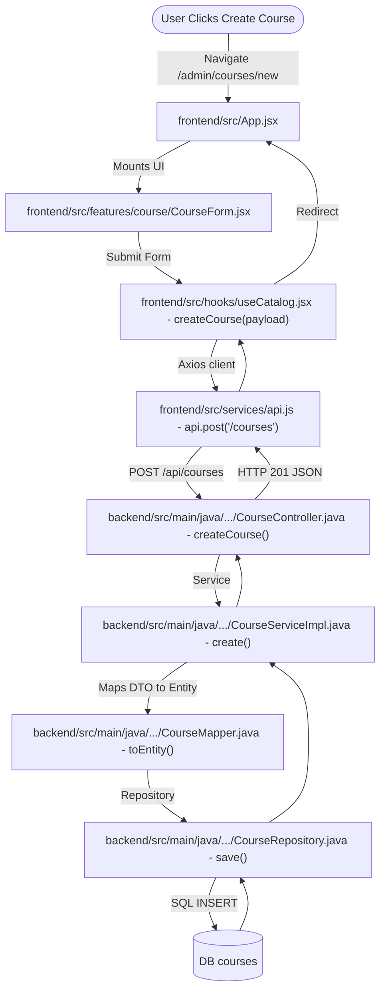

# Course Module Flow & Reference Documentation

This document outlines the data fields and the end-to-end frontend-to-backend request flows for the **Courses** component in Xebia LMS.

---

## 1. Course Entity Fields

*   **Database Table:** `courses`
*   **Entity File:** backend/src/main/java/com/geeknito/LMS_backend/entity/learning/CourseEntity.java
*   **Request DTO:** backend/src/main/java/com/geeknito/LMS_backend/dto/CourseRequestDTO.java
*   **Response DTO:** backend/src/main/java/com/geeknito/LMS_backend/dto/CourseResponseDTO.java

### Field List
1.  `id` (`Long`, Primary Key, Generated Identity)
2.  `title` (`String`, `NOT NULL`, max 200)
3.  `slug` (`String`, `NOT NULL`, `UNIQUE`, max 250)
4.  `description` / `shortDescription` (`String`, TEXT)
5.  `level` (`String`, max 50)
6.  `language` (`String`, max 100)
7.  `duration` (`String`, max 100)
8.  `icon` / `thumbnail` / `bannerImage` / `backgroundImage` (`String` image URLs)
9.  `isActive` (`Boolean`) / `isFeatured` (`Boolean`) / `isPublished` (`Boolean`)
10. `categoryId` (`Long`, Foreign Key linking to `categories` table)
11. **SEO Fields:** `metaTitle`, `metaDescription`, `metaKeywords`, `canonicalUrl`, `primaryKeyword`, `secondaryKeywords`, `focusKeywords`, `robots`, `ogTitle`, `ogDescription`, `ogImage`, `ogUrl`, `ogType`, `twitterTitle`, `twitterDescription`, `twitterImage`, `twitterCard`, `schemaMarkup`, `faqSchema`, `breadcrumbSchema`
12. **Programmatic SEO & Metrics:** `learningOutcomes`, `prerequisites`, `targetAudience`, `courseHighlights`, `careerOpportunities`, `searchIntent`, `semanticKeywords`, `relatedTopics`, `searchSynonyms`, `faqContent`, `totalViews`, `totalClicks`, `ctr`, `seoScore`

---

## 2. End-to-End Course Creation Flow

### Step-by-Step Execution Sequence
1.  **Frontend trigger:** User fills out form fields in frontend/src/features/course/CourseForm.jsx and clicks "Create Course".
2.  **State Hook:** frontend/src/hooks/useCatalog.jsx runs `createCourse(payload)`, preparing the DTO payload.
3.  **Axios API layer:** frontend/src/services/api.js dispatches the POST request to `POST /api/courses`.
4.  **REST Controller:** backend/src/main/java/com/geeknito/LMS_backend/controller/CourseController.java maps payload to `CourseRequestDTO` in `createCourse()`.
5.  **Service Impl:** backend/src/main/java/com/geeknito/LMS_backend/serviceImpl/CourseServiceImpl.java transforms the DTO into database domain entity mapping via backend/src/main/java/com/geeknito/LMS_backend/mapper/CourseMapper.java.
6.  **Repository save:** backend/src/main/java/com/geeknito/LMS_backend/repository/CourseRepository.java executes hibernate inserts into the `courses` database table.

---
