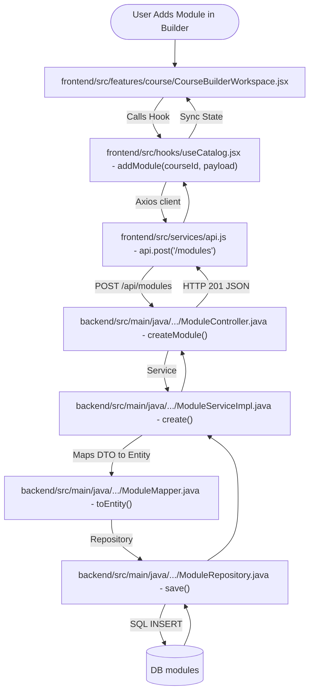
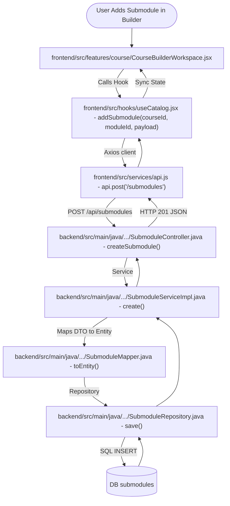
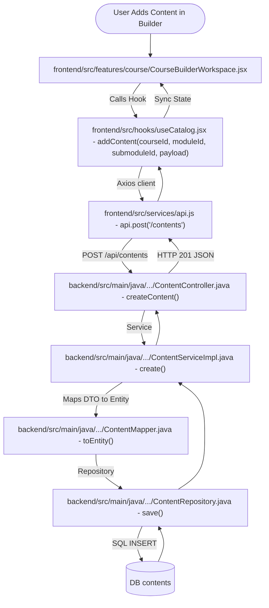

# Curriculum Modules Flow & Reference Documentation

This document outlines the data fields and the end-to-end frontend-to-backend request flows for the **Modules, Submodules, and Contents** (Curriculum) components in Xebia LMS.

---

## 1. Data Models & Entity Fields

### 1.1 Modules
*   **Database Table:** `modules`
*   **Entity File:** backend/src/main/java/com/geeknito/LMS_backend/entity/learning/ModuleEntity.java
*   **Request DTO:** backend/src/main/java/com/geeknito/LMS_backend/dto/ModuleRequestDTO.java
*   **Response DTO:** backend/src/main/java/com/geeknito/LMS_backend/dto/ModuleResponseDTO.java

#### Core Fields
1.  `id` (`Long`, Primary Key, Generated Identity)
2.  `title` (`String`, `NOT NULL`, max 200)
3.  `description` (`String`, TEXT)
4.  `moduleOrder` (`Integer`, sorting order index)
5.  `isActive` (`Boolean`)
6.  `courseId` (`Long`, Foreign Key linking to `courses` table)

---

### 1.2 Submodules
*   **Database Table:** `submodules`
*   **Entity File:** backend/src/main/java/com/geeknito/LMS_backend/entity/learning/SubmoduleEntity.java
*   **Request DTO:** backend/src/main/java/com/geeknito/LMS_backend/dto/SubmoduleRequestDTO.java
*   **Response DTO:** backend/src/main/java/com/geeknito/LMS_backend/dto/SubmoduleResponseDTO.java

#### Core Fields
1.  `id` (`Long`, Primary Key, Generated Identity)
2.  `title` (`String`, `NOT NULL`, max 200)
3.  `description` (`String`, TEXT)
4.  `slug` (`String`, `NOT NULL`, `UNIQUE`, max 250)
5.  `submoduleOrder` (`Integer`, sorting order index)
6.  `isActive` (`Boolean`)
7.  `moduleId` (`Long`, Foreign Key linking to `modules` table)
8.  **SEO Fields:** `metaTitle`, `metaDescription`, `canonicalUrl`, `ogTitle`, `ogDescription`, `ogImage`

---

### 1.3 Contents
*   **Database Table:** `contents`
*   **Entity File:** backend/src/main/java/com/geeknito/LMS_backend/entity/learning/ContentEntity.java
*   **Request DTO:** backend/src/main/java/com/geeknito/LMS_backend/dto/ContentRequestDTO.java
*   **Response DTO:** backend/src/main/java/com/geeknito/LMS_backend/dto/ContentResponseDTO.java

#### Core Fields
1.  `id` (`Long`, Primary Key, Generated Identity)
2.  `title` (`String`, max 300)
3.  `type` (`String`, `NOT NULL`, max 30 - e.g., notes, code, video, image, heading, etc.)
4.  `text` (`String`, columnDefinition = "LONGTEXT")
5.  `code` (`String`, columnDefinition = "TEXT")
6.  `language` (`String`, max 50)
7.  `videoUrl` / `imageUrl` (`String`, max 500)
8.  `alt` (`String`, max 200)
9.  `caption` (`String`, max 300)
10. `headingLevel` (`Integer`)
11. `contentOrder` (`Integer`, sorting order index)
12. `isActive` (`Boolean`)
13. `submoduleId` (`Long`, Foreign Key linking to `submodules` table)

---

## 2. End-to-End Flows (Frontend to Backend)

### 2.1 Flow 1: Adding a Module in Course Builder

#### Step-by-Step Execution Sequence
1.  **Frontend trigger:** Within frontend/src/features/course/CourseBuilderWorkspace.jsx, the user clicks "Add Module", enters a title, and confirms.
2.  **State Hook:** frontend/src/hooks/useCatalog.jsx triggers `addModule(courseId, payload)`, computing `moduleOrder` index dynamically.
3.  **Axios API layer:** frontend/src/services/api.js sends JSON body to `POST /api/modules`.
4.  **REST Controller:** backend/src/main/java/com/geeknito/LMS_backend/controller/ModuleController.java binds the parameter attributes to `ModuleRequestDTO`.
5.  **Service Impl:** backend/src/main/java/com/geeknito/LMS_backend/serviceImpl/ModuleServiceImpl.java transforms the mapping using backend/src/main/java/com/geeknito/LMS_backend/mapper/ModuleMapper.java.
6.  **Repository save:** backend/src/main/java/com/geeknito/LMS_backend/repository/ModuleRepository.java commits records to the `modules` database table.

---

### 2.2 Flow 2: Adding a Submodule in Course Builder

#### Step-by-Step Execution Sequence
1.  **Frontend trigger:** In the course building panel (frontend/src/features/course/CourseBuilderWorkspace.jsx), the user clicks "Add Submodule" inside a module card.
2.  **State Hook:** frontend/src/hooks/useCatalog.jsx calls `addSubmodule(courseId, moduleId, payload)`.
3.  **Axios API layer:** frontend/src/services/api.js dispatches data payload to `POST /api/submodules`.
4.  **REST Controller:** backend/src/main/java/com/geeknito/LMS_backend/controller/SubmoduleController.java receives request parameters in `createSubmodule()`.
5.  **Service Impl:** backend/src/main/java/com/geeknito/LMS_backend/serviceImpl/SubmoduleServiceImpl.java maps inputs using backend/src/main/java/com/geeknito/LMS_backend/mapper/SubmoduleMapper.java and saves.
6.  **Repository save:** backend/src/main/java/com/geeknito/LMS_backend/repository/SubmoduleRepository.java saves submodule details.

---

### 2.3 Flow 3: Creating Content under a Submodule

#### Step-by-Step Execution Sequence
1.  **Frontend trigger:** Inside a submodule's dropdown builder, the user chooses a content type (notes, video, code, heading) and clicks "Add Content Item".
2.  **State Hook:** frontend/src/hooks/useCatalog.jsx calls `addContent(courseId, moduleId, submoduleId, payload)`.
3.  **Axios API layer:** frontend/src/services/api.js dispatches the details to `POST /api/contents`.
4.  **REST Controller:** backend/src/main/java/com/geeknito/LMS_backend/controller/ContentController.java parses request into `ContentRequestDTO`.
5.  **Service Impl:** backend/src/main/java/com/geeknito/LMS_backend/serviceImpl/ContentServiceImpl.java converts DTO to Entity using backend/src/main/java/com/geeknito/LMS_backend/mapper/ContentMapper.java and runs the transaction.
6.  **Repository save:** backend/src/main/java/com/geeknito/LMS_backend/repository/ContentRepository.java inserts content attributes into table.
